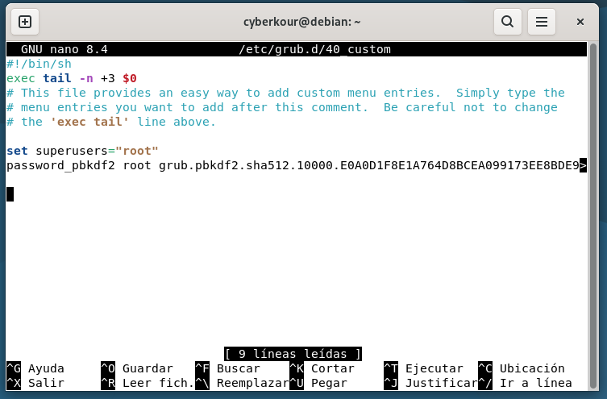
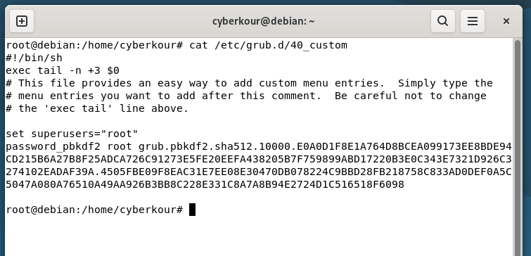
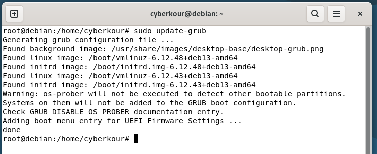
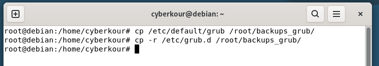
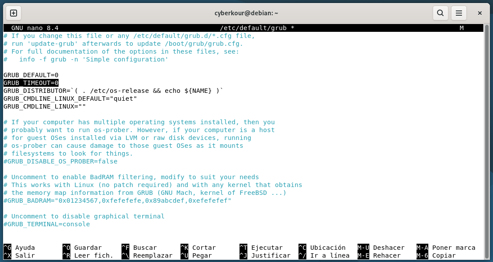
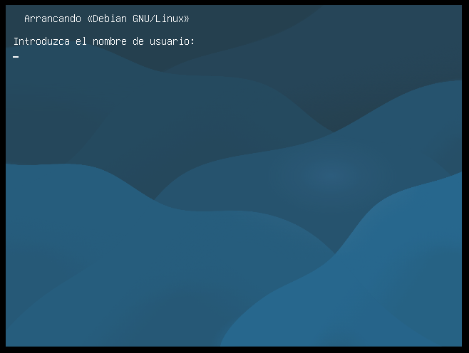
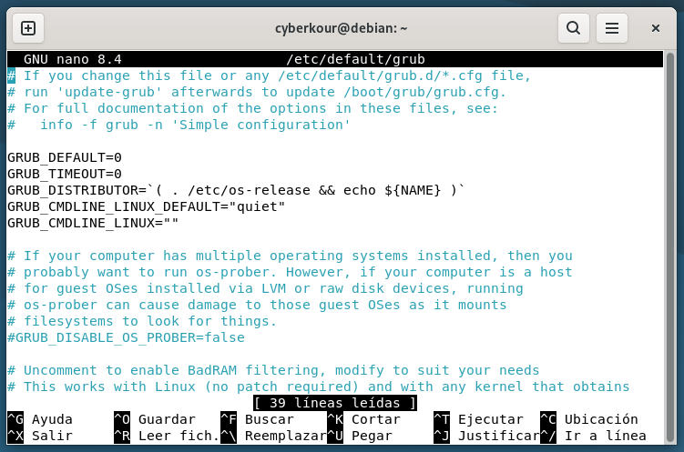
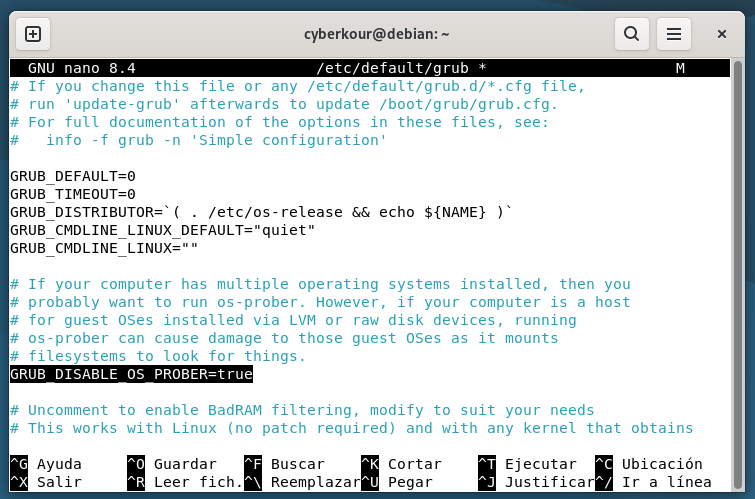

summary: Guía de Bastionado del arranque en Linux
id: guia-bastionado-arranque-linux
categories: guia
status: Published
authors: Sergio González Noria
feedback link: https://github.com/sgonnor2803

# Guía de Bastionado del Arranque en Linux

## Introducción

Durante el arranque de un sistema Linux, el gestor **GRUB2** es el encargado de iniciar el sistema operativo y definir cómo se realiza este proceso. Sin embargo, si no se encuentra correctamente protegido, puede convertirse en un punto débil de seguridad, ya que un usuario con acceso físico al equipo podría modificar sus opciones y obtener privilegios no autorizados.

Por ello, resulta fundamental aplicar medidas de protección que impidan la manipulación del arranque y garanticen la integridad del sistema.  
En esta guía se detallan los pasos necesarios para reforzar la seguridad del proceso de arranque en una distribución **Debian**, configurando distintas opciones de GRUB2 que ayudan a prevenir accesos no deseados y asegurar un arranque confiable.

## Contraseña para proteger GRUB2

Configurar una contraseña en **GRUB2** permite proteger el proceso de arranque frente a accesos no autorizados. De esta forma, solo los usuarios con privilegios podrán modificar o iniciar el sistema desde opciones avanzadas.

- Para ello, primero vamos a abrir una terminal en nuestro sistema **Debian**.


- Una vez en la terminal, cambiaremos a usuario root para tener permisos totales sobre el sistema.

```bash
su root
```


- Editaremos el archivo de configuración de GRUB2. Ejecutamos el siguiente comando para realizar esa modificación.

```bash
nano /etc/grub.d/40_custom
```


- Antes de todo, para mayor protección cifraremos la contraseña, ejemplo: ***Piq7hCze4nVi***, para que no se guarde en texto plano. Para ello, ejecutaremos el siguiente comando (con permisos root) e introduciremos la contraseña dos veces, en una nueva terminal:
```bash
grub-mkpasswd-pbkdf2
```


- Ahora que tenemos el hash de la contraseña, modificaremos el anterior archivo definiendo tanto el usuario administrador como la contraseña correspondiente (**hash**). Esta será las credenciales que nos pedirán para acceder al menú protegido del propio GRUB2.
```bash
set superusers="root"
password_pbkdf2 root grub.pbkdf2.sha512.10000.D8BBE80...
```



- Una vez introducido los cambios en el archivo, guardaremos el archivo con el atajo de teclado ***Ctrl + O*** y para salir del archivo usaremos el atajo de teclado ***Ctrl + X***.


> Prueba de que el archivo se ha guardado correctamente, mostrando su contenido con el comando ***cat***.

- Actualizamos GRUB para que lea los cambios que hemos establecido anteriormente. Para ello, ejecutamos el siguiente comando:
```bash
sudo update-grub
```



- Por último, solo quedaria reiniciar el equipo y cuando se muestre el menú de GRUB, con solo darle a **enter** para que inicie el sistema, ya nos pedirá las credenciales que hemos definido.


> Como podemos ver, nos pedirá las credenciales que hemos definido anteriormente. De esta forma, garantizamos que solo los administradores autorizados puedan modificar o iniciar el sistema desde opciones avanzadas, reforzando así la seguridad del arranque.


## Copia de seguridad de la configuración del arranque

Realizar una copia de seguridad de los archivos de configuración de GRUB2 es una medida preventiva esencial. Permite restaurar el arranque en caso de errores o configuraciones incorrectas que impidan iniciar el sistema.

- Para ello, partiendo desde una terminal con permisos **root** (mostrado anteriormente), realizaremos los siguientes pasos para realizar dichas copias de seguridad de la configuración del arranque.


- Primero, vamos a crear un directorio donde almacenaremos las copias de seguridad. Por ejemplo, crearé un directorio ***backups_grub*** en la ruta ***/root/***. Para ello, ejecutamos el siguiente comando:

```bash
mkdir /root/backups_grub
```


- Ahora, crearemos la copia de seguridad de los archivos de configuración del arranque (**GRUB**). Ejecutaremos los siguiente comando primero para copiar dichos archivos de configuración al directorio que hemos creado:

```bash
cp /etc/default/grub /root/backups_grub/
cp -r /etc/grub.d /root/backups_grub/
```




> En la última imágen, se muestran los archivos que hemos copiado en el directorio de **backups_grub**.

- Por último, crearemos el archivo comprimido, en el directorio ***/root/***, que contendrá toda la configuración actual del arranque. Para ello, ejecutaremos el siguiente comando:

```bash
tar -czvf /root/backups_grub_$(date +%F).tar.gz /root/backups_grub
```


Mantener una copia de seguridad actualizada de la configuración del arranque permite restaurar rápidamente el sistema ante cualquier fallo o error de configuración, garantizando la continuidad y estabilidad del entorno.

## Ajuste de permisos del archivo de configuración

Una vez configurada la contraseña en **GRUB2**, es fundamental proteger el archivo donde se almacena esta información para evitar que otros usuarios puedan leerlo o modificarlo sin autorización.
Restringir los permisos de acceso garantiza que solo el usuario **root** pueda realizar cambios en la configuración del gestor de arranque.

- Primero, accedemos a una terminal con permisos root como lo hemos comentado anteriormente en esta guía.


- Ahora, verificamos los permisos actuales que tiene el archivo de configuración ***/etc/grub.d/40_custom***. Para ello, ejecutamos el siguiente comando:

```bash
ls -l /etc/grub.d/40_custom
```


- Los permiso recomendados para este archivo de configuración seria 700 (rwx------). Esto quiere decir, todos los permisos tanto lectura/escritura/ejecución para el propietario (**root**), y para los demás ningún permiso en este archivo. Para ello, ejecutamos el siguiene comando:

```bash
chmod 700 /etc/grub.d/40_custom
```


- También podemos reforzar la seguridad cambiando el propietario/grupo del archivo, si el propietario no es **root**. Para ello, ejecutamos el siguiente comando:

```bash
chown root:root /etc/grub.d/40_custom
```


- Por último, comprobamos que tanto los permiso como el propietario/grupo sea el que hemos definido anteriormente. Para ello, ejecutamos el siguiente comando:

```bash
ls -l /etc/grub.d/40_custom
```


> De esta manera, el archivo que contiene la configuración y la contraseña cifrada de **GRUB2** queda totalmente protegido frente a modificaciones no autorizadas, reforzando así la seguridad global del proceso de arranque. 

Además, se recomienda aplicar una política de permisos al resto de archivos de configuración del **GRUB2**.

```bash
chmod 700 /etc/grub.d
chmod 600 /etc/default/grub
chmod 600 /boot/grub/grub.cfg
chown -R root:root /etc/grub.d /etc/default/grub /boot/grub/grub.cfg
```

De esta forma, aseguramos que todos los archivos sensibles de GRUB2 estén protegidos contra modificaciones no autorizadas, manteniendo un control estricto sobre quién puede alterar la configuración del arranque.

## Ocultar el menú de GRUB2

Ocultar el menú de GRUB2 es una medida adicional de seguridad que impide que un usuario no autorizado modifique o acceda a opciones avanzadas durante el arranque del sistema.
De esta forma, el equipo iniciará directamente el sistema operativo sin mostrar el menú de GRUB, reduciendo la posibilidad de manipulación.

- En primer lugar, accederemos a una terminal con permisos **root** como en los anteriores apartados de esta guía.


- Ahora, abriremos el archivo de configuración principal de GRUB2, se encuentra en ***/etc/default/grub***. Para ello, ejecutaremos el siguiente comando:

```bash
nano /etc/default/grub
```


- Una vez que hemos accedido al archivo, localizamos la siguiente línea, que es la que vamos a modificar:

```bash
GRUB_TIMEOUT=5
```


- Una vez localizada la línea, modificaremos el valor de la siguiente manera:

```bash
GRUB_TIMEOUT=0
```


> Con esta configuración, el menú permanecerá oculto y el sistema arrancará automáticamente sin mostrar opciones al usuario.

- Una vez introducido los cambios en el archivo, guardaremos el archivo con el atajo de teclado ***Ctrl + O*** y para salir del archivo usaremos el atajo de teclado ***Ctrl + X***.


> Prueba de que el archivo se ha guardado correctamente, mostrando su contenido con el comando ***cat***.

- Actualizamos GRUB para que lea los cambios que hemos establecido anteriormente. Para ello, ejecutamos el siguiente comando:

```bash
sudo update-grub
```


- Por último, comprobamos que al reiniciar el sistema no nos mostrará el menú de GRUB2.



> Tras reiniciar el sistema, el arranque se realizará automáticamente sin mostrar el menú de GRUB2 y mostrará la pantalla para acceder mediante las credenciales que hemos configurado en los primeros apartados de esta guía, dificultando el acceso a las opciones avanzadas para usuarios no autorizados.

Con esta configuración, el proceso de arranque se vuelve más discreto y seguro, reduciendo la exposición del menú de GRUB2 y limitando las posibilidades de manipulación por parte de usuarios no autorizados.

## Otras medidas complementarias

Además de proteger **GRUB2**, podemos aplicar medidas adicionales que fortalecen la seguridad del arranque, impidiendo manipulaciones o accesos no autorizados al sistema.

### Protección del directorio ***/boot***

El directorio ***/boot*** contiene los archivos críticos del arranque, como el **kernel**, el **initramfs** y la configuración de **GRUB2**. Si un atacante logra modificar estos archivos, podría alterar completamente el comportamiento del sistema o inyectar código malicioso. Para evitarlo, debemos restringir los permisos de acceso a este directorio, garantizando que solo el usuario root pueda gestionarlo.

- En primer lugar, accederemos a una terminal con permisos **root** como en los anteriores apartados de esta guía.


- Ahora, modificamos los permisos del directorio ***/boot*** para que solo el administrador (**root**) tenga acceso total. Para ello, ejecutamos el siguiente comando:

```bash
chmod -R 700 /boot
```


- Tambien aseguramos que el propietario/grupo del directorio sean **root**. Para ello, ejecutamos el siguiente comando:

```bash
chown -R root:root /boot
```


- Por último, comprobamos que los permisos y el propietario sean los correctos:

```bash
ls -ld /boot
```


Con estos ajustes, se impide que otros usuarios del sistema puedan listar, modificar o eliminar archivos dentro de **/boot**, reduciendo el riesgo de manipulación del arranque o sustitución del kernel.

### Desactivar el arranque desde otros sistmas o dispositvos externos

Otra medida importante consiste en impedir que GRUB detecte o muestre otros sistemas operativos (por ejemplo, Windows o particiones externas). Esto evita que un usuario pueda arrancar el equipo desde otro sistema y manipular los archivos del disco.

- En primer lugar, accederemos a una terminal con permisos **root** como en los anteriores apartados de esta guía.


- Ahora, editamos el archivo de configuración de GRUB (***/etc/default/grub***). Para ello, ejecutamos el siguiente comando:

```bash
nano /etc/default/grub
```




- Añadimos (o modificamos si ya existe) la siguiente línea:

```bash
GRUB_DISABLE_OS_PROBER=true
```



- Una vez introducido los cambios en el archivo, guardaremos el archivo con el atajo de teclado ***Ctrl + O*** y para salir del archivo usaremos el atajo de teclado ***Ctrl + X***.


> Prueba de que el archivo se ha guardado correctamente, mostrando su contenido con el comando ***cat***.

- Actualizamos GRUB para que lea los cambios que hemos establecido anteriormente. Para ello, ejecutamos el siguiente comando:

```bash
sudo update-grub
```


Con esto, GRUB2 dejará de buscar y mostrar otros sistemas operativos o discos externos durante el arranque, reduciendo las vías de acceso al equipo.
<br>
Aplicando ambas medidas, el arranque del sistema queda mucho más protegido: el contenido de /boot no puede modificarse sin privilegios explícitos y se evita que GRUB cargue sistemas ajenos o ubicados en medios externos.

## Conclusiones

Con esta guía hemos reforzado la seguridad del arranque en Linux, protegiendo una de las partes más críticas del sistema.
Al establecer una contraseña en GRUB2, restringir los permisos de sus archivos de configuración, ocultar el menú de arranque y proteger el directorio /boot, logramos evitar que usuarios no autorizados puedan modificar o acceder a opciones del sistema durante el inicio.

Además, al desactivar el arranque desde otros sistemas o dispositivos externos, se limita la posibilidad de manipulación mediante medios externos, reduciendo aún más los riesgos de acceso físico no autorizado.

En conjunto, todas estas medidas hacen que el proceso de arranque sea mucho más seguro y controlado, manteniendo la integridad del sistema y sentando una buena base para seguir aplicando prácticas de bastionado en Linux.